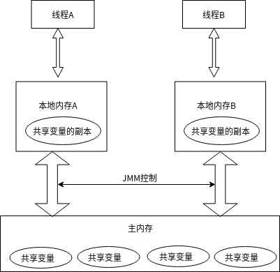

# JVM

## 请谈谈你对volatile的理解

### 1、volatile是Java虚拟机提供的轻量级的同步机制

#### 1.1、保证可见性

#### 1.2、不保证原子性

#### 1.3、禁止指令重排

### 2、谈谈JMM

**JMM**（Java内存模型，Java Memory Model），本身是一种抽象的概念，并不真实存在，它描述的是一种规则或规范，通过这则规范定义了程序中各个变量（包括实例字段，静态字段和构成数组对象的元素）的访问方式。

**JMM**关于同步的规定：

1. 线程解锁前必须把共享变量的值刷新回主内存
2. 线程加锁前，必须读取主内存的最新值到自己的工作内存
3. 加锁解锁是同一把锁

由于**JMM**运行程序的实体是线程，而每一个线程创建时**JMM**都会为其创建一个工作内存（有时也称为栈空间），工作内存是每个线程的私有数据区域而Java内存模型中规定的所有变量都存储在主内存，主内存是共享内存区域，所有线程都可以访问，但线程对变量的操作（读取赋值等）都必须在工作内存中进行，首先要将变量从主内存拷贝到自己的工作内存空间，然后对变量进行操作，操作完成后再将变量写回主内存，不能直接操作主内存中的变量，各个线程中的工作内存中存储着主内存中的变量副本拷贝，因此不同的线程间不能直接访问对方的工作内存，线程间的通信（传值）必须通过主内存来完成

#### 2.1、可见性

#### 2.2、原子性

#### 2.4、有序性